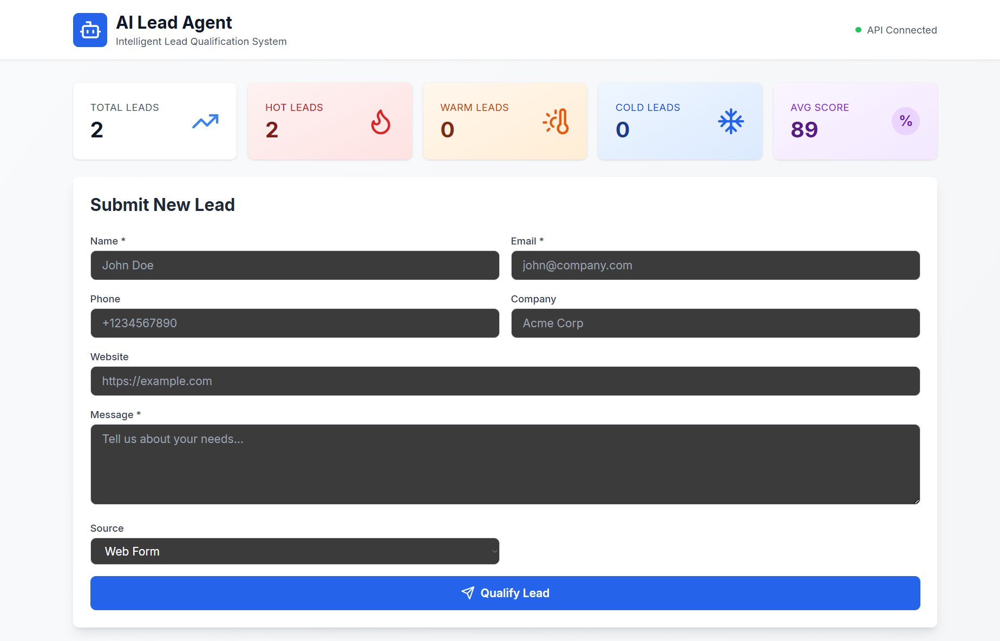
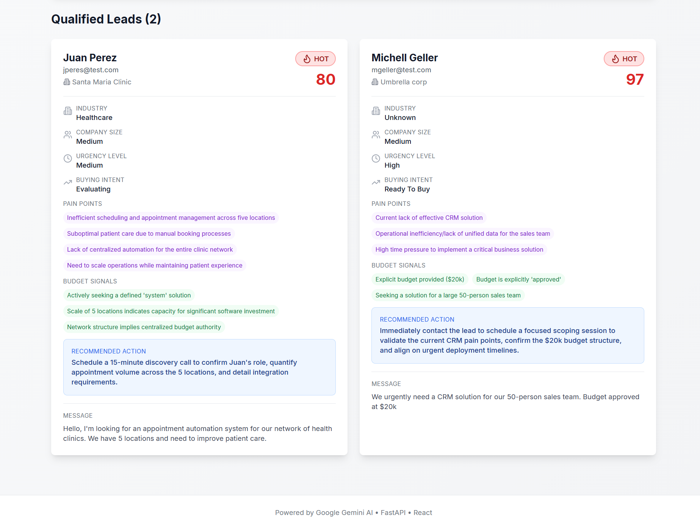
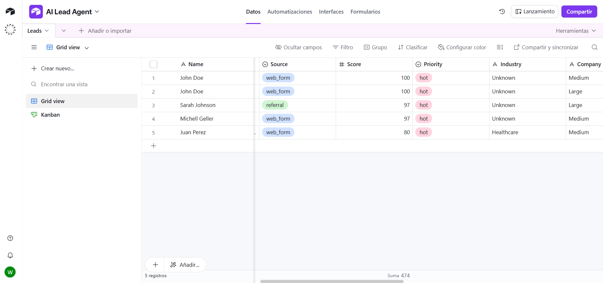

# 🤖 AI Lead Agent

> Intelligent lead qualification system powered by Google Gemini AI, FastAPI, and n8n automation.

[](https://opensource.org/licenses/MIT)
[](https://www.python.org/downloads/)
[](https://fastapi.tiangolo.com/)
[](https://react.dev/)

## 🎯 Overview

AI Lead Agent automatically qualifies and scores leads using advanced AI analysis, providing actionable insights for sales teams. The system analyzes lead messages to extract:

- 🎯 **Lead Score** (0-100) based on buying signals
- 🔥 **Priority Level** (Hot/Warm/Cold)
- 💼 **Industry & Company Size**
- 🚨 **Urgency Level & Buying Intent**
- 💰 **Budget Signals**
- 😣 **Pain Points**
- ✅ **Recommended Actions**

## 🌟 Key Features

- ✅ **AI-Powered Qualification** - Google Gemini analyzes lead intent and urgency
- ✅ **Real-time Scoring** - Instant lead prioritization (0-100 scale)
- ✅ **Automated Workflows** - n8n integration for notifications and actions
- ✅ **Airtable Integration** - Automatic lead storage and management
- ✅ **Beautiful Dashboard** - React UI with real-time updates and stats
- ✅ **RESTful API** - Easy integration with any system or CRM
- ✅ **Docker Ready** - One-command deployment with Docker Compose

## 📸 Screenshots

### Dashboard Overview


_Real-time lead qualification dashboard with comprehensive statistics_

### Lead Analysis Card


_Detailed AI analysis showing score, priority, pain points, and recommended actions_

### n8n Automation Workflow


_Automated lead processing workflow with conditional notifications_

### Airtable Integration


_Leads automatically saved with full AI analysis in Airtable_

## 🏗️ Architecture

```
┌─────────────┐
│   Frontend  │  React Dashboard (Port 3000)
│   (React)   │
└──────┬──────┘
       │
       ▼
┌─────────────┐
│   Backend   │  FastAPI + AI Agent (Port 8000)
│  (FastAPI)  │
└──────┬──────┘
       │
       ├──────────► Google Gemini AI (Lead Analysis)
       ├──────────► Airtable (Lead Storage)
       │
       ▼
┌─────────────┐
│     n8n     │  Workflow Automation (Port 5678)
│ (Webhooks)  │
└─────────────┘
```

## 🚀 Quick Start

### Prerequisites

- Docker & Docker Compose
- Google Gemini API Key ([Get it here](https://makersuite.google.com/app/apikey))
- Airtable Account ([Sign up](https://airtable.com))

### 1. Clone the Repository

```bash
git clone https://github.com/WaltGreenwich/ai-lead-agent.git
cd ai-lead-agent
```

### 2. Configure Environment Variables

```bash
cp .env.example .env
```

Edit `.env` with your credentials:

```env
# Required
GEMINI_API_KEY=your_gemini_api_key_here
AIRTABLE_API_KEY=your_airtable_api_key_here
AIRTABLE_BASE_ID=your_airtable_base_id_here

# Optional (defaults provided)
AIRTABLE_TABLE_NAME=Leads
API_HOST=0.0.0.0
API_PORT=8000
HIGH_SCORE_THRESHOLD=80.0
MEDIUM_SCORE_THRESHOLD=60.0
```

### 3. Setup Airtable

Create a base called "AI Lead Agent" with a table named "Leads" containing these fields:

| Field Name         | Type             | Options                                 |
| ------------------ | ---------------- | --------------------------------------- |
| Name               | Single line text |                                         |
| Email              | Email            |                                         |
| Phone              | Phone number     |                                         |
| Company            | Single line text |                                         |
| Website            | URL              |                                         |
| Message            | Long text        | ⭐ Important                            |
| Source             | Single select    | web_form, email, phone, referral, other |
| Score              | Number           | 0-100, no decimals                      |
| Priority           | Single select    | hot, warm, cold                         |
| Status             | Single select    | new, contacted, qualified, closed       |
| Industry           | Single line text |                                         |
| Company Size       | Single line text |                                         |
| Urgency Level      | Single select    | high, medium, low                       |
| Buying Intent      | Single line text |                                         |
| Pain Points        | Long text        | ⭐ Important                            |
| Budget Signals     | Long text        | ⭐ Important                            |
| Recommended Action | Long text        | ⭐ Important                            |
| Created At         | Created time     | Auto-generated                          |

### 4. Start the Application

```bash
docker-compose up -d
```

### 5. Access the Services

- **Frontend Dashboard**: http://localhost:3000
- **API Documentation**: http://localhost:8000/docs
- **n8n Automation**: http://localhost:5678 (admin/admin123)

## 📖 Usage

### Submit a Lead via Frontend

1. Open http://localhost:3000
2. Fill in the lead form
3. Click "Qualify Lead"
4. View instant AI analysis with score and recommendations

### Submit a Lead via API

```bash
curl -X POST http://localhost:8000/leads \
  -H "Content-Type: application/json" \
  -d '{
    "name": "Sarah Johnson",
    "email": "sarah@bigcorp.com",
    "phone": "+1234567890",
    "company": "BigCorp Inc",
    "website": "https://bigcorp.com",
    "message": "We urgently need a CRM solution for our 200-person sales team. Budget approved at $100k.",
    "source": "referral"
  }'
```

### Submit a Lead via n8n Webhook

1. Import the workflow from `n8n/workflows/lead-qualification.json`
2. Activate the workflow
3. Use the webhook URL:

```bash
curl -X POST http://localhost:5678/webhook/lead \
  -H "Content-Type: application/json" \
  -d '{
    "name": "John Doe",
    "email": "john@example.com",
    "phone": "+12312312312",
    "company": "Umbrella Corp",
    "message": "Looking for mi clinic CRM solution with AI",
    "source": "web_form"
  }'
```

## 🧪 Testing

```bash
# Run backend tests
docker-compose exec backend pytest -v

# Run with coverage
docker-compose exec backend pytest --cov=. -v

# Test specific module
docker-compose exec backend pytest tests/test_ai_agent.py -v
```

## 📊 Lead Scoring Algorithm

The AI analyzes leads using a 100-point scoring system:

| Factor             | Points | Criteria                                                          |
| ------------------ | ------ | ----------------------------------------------------------------- |
| **Urgency**        | 30     | High (30), Medium (20), Low (10)                                  |
| **Buying Intent**  | 40     | Ready to buy (40), Evaluating (30), Exploring (20), Browsing (10) |
| **Budget Signals** | 15     | 3+ signals (15), 2 signals (10), 1 signal (5)                     |
| **Pain Points**    | 15     | 4+ points (15), 3 points (12), 2 points (8), 1 point (4)          |

**Priority Assignment:**

- 🔥 **HOT** (80-100): Immediate action required
- 🌡️ **WARM** (60-79): Follow up within 24-48 hours
- ❄️ **COLD** (0-59): Nurture campaign

## 🔧 Development

### Project Structure

```
ai-lead-agent/
├── backend/                 # FastAPI backend
│   ├── main.py             # API endpoints
│   ├── config.py           # Configuration
│   ├── models/
│   │   └── schemas.py      # Pydantic models
│   ├── services/
│   │   ├── ai_agent.py     # Gemini AI integration
│   │   └── airtable_client.py
│   └── tests/              # Unit tests
├── dashboard/              # React frontend
│   ├── src/
│   │   ├── App.jsx
│   │   ├── components/
│   │   └── services/
│   └── package.json
├── n8n/
│   └── workflows/          # n8n automation workflows
├── demo/                   # Demo scripts & samples
└── docker-compose.yml
```

### Local Development

```bash
# Backend
cd backend
pip install -r requirements.txt
python main.py

# Frontend
cd dashboard
npm install
npm run dev

# n8n
docker run -p 5678:5678 n8nio/n8n
```

## 🤝 Contributing

Contributions are welcome! Please feel free to submit a Pull Request.

1. Fork the project
2. Create your feature branch (`git checkout -b feature/AmazingFeature`)
3. Commit your changes (`git commit -m 'Add some AmazingFeature'`)
4. Push to the branch (`git push origin feature/AmazingFeature`)
5. Open a Pull Request

## 📄 License

This project is licensed under the MIT License - see the [LICENSE](LICENSE) file for details.

## 🙏 Acknowledgments

- [Google Gemini AI](https://ai.google.dev/) - AI-powered lead analysis
- [FastAPI](https://fastapi.tiangolo.com/) - Modern Python web framework
- [n8n](https://n8n.io/) - Workflow automation
- [Airtable](https://airtable.com/) - Database and CRM
- [React](https://react.dev/) - Frontend framework
- [Tailwind CSS](https://tailwindcss.com/) - UI styling

## 📞 Contact

Walt Greenwich - [@WaltGreenwich](https://github.com/WaltGreenwich)

Project Link: [https://github.com/WaltGreenwich/ai-lead-agent](https://github.com/WaltGreenwich/ai-lead-agent)

---

**⭐ Star this repo if you find it useful!**
